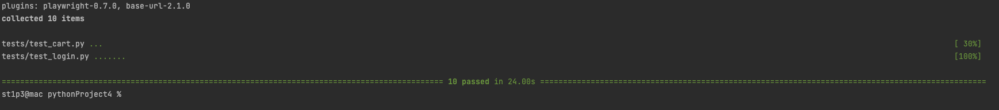

## FE Tests Setup Guide

### 🛠 **Framework and Tools**  
- **Framework**: [Playwright](https://playwright.dev/python/docs/intro)  
- **Language**: Python (Running on 3.12.8)
- **IDE**: Recommended [PyCharm](https://www.jetbrains.com/pycharm/), but you can use any other based on you preference
- **URL**: [SauceDemo](https://www.saucedemo.com/)

---

### 📂 **Setup Instructions**

#### 1. **Install Dependencies**  
Install required libraries with:  
```bash
pip install pytest-playwright
```
and 
```bash
playwright install 
```
---

### ▶️ **Running Tests Locally**

### **Run All Tests**  
To execute all tests, type in your terminal:  
```bash
pytest
```

### **Example Of Test Results:**


Note: Tests are run in headless mode